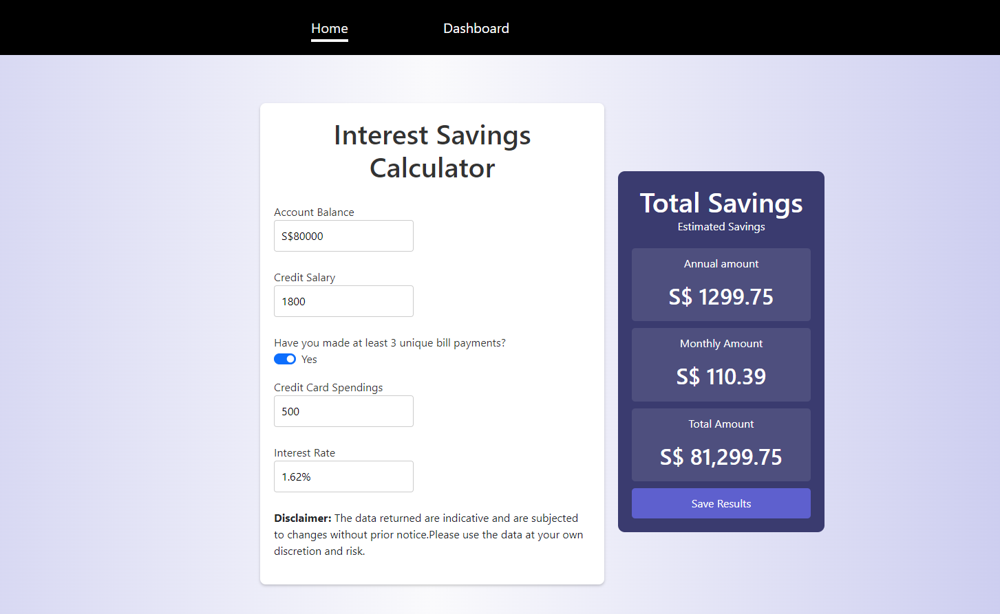
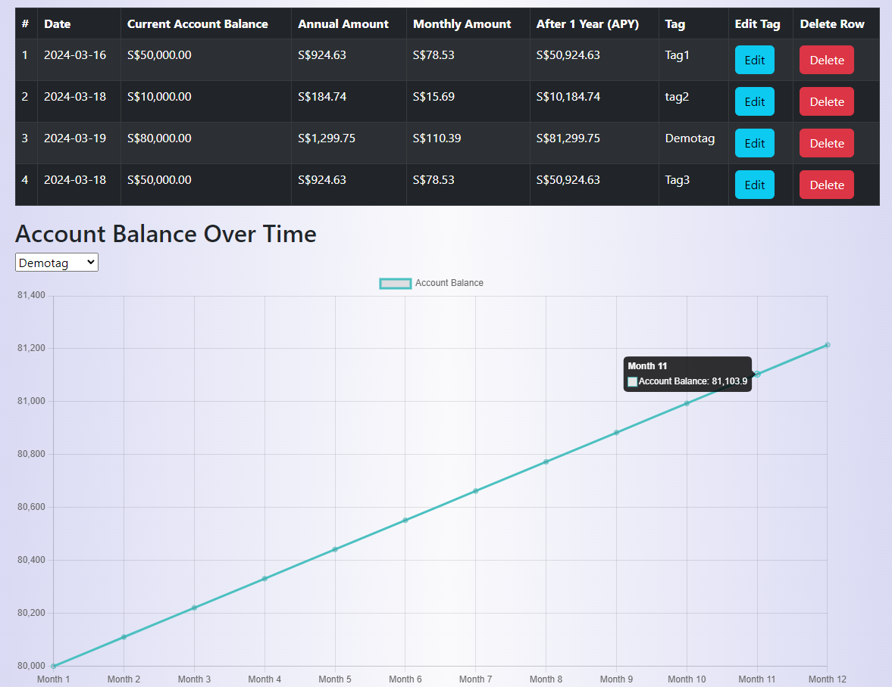

# Interest Savings Calculator

This is a web application that calculates the interest earned based on your account balance and certain activities such as crediting your salary, making bill payments, and spending on your credit cards. It fetches data from an API to get the base interest rate and calculates the interest rate based on the account balance provided by the user.

## Screenshots

## Features

- Interest Savings Calculation: Users can input their account balance, credit salary, bill payments, and credit card spendings to calculate their potential savings.
- Dynamic Chart Visualization: The app generates a dynamic line chart to visualize the account balance over time based on user inputs.
- Data Persistence: User data is stored securely using Airtable API, allowing users to access their past calculations and compare results.
- A User-friendly interface

## Technologies Used

- **React**: The frontend of the application is built using React library, providing a modular and efficient user interface
- **Chart.js**: Dynamic line chart visualization is implemented using the Chart.js library, allowing for interactive and customizable charts.
- **Airtable API**: User data is stored and retrieved using Airtable API, ensuring data persistence and accessibility.
- **React Bootstrap**: React Bootstrap components are used for UI elements and styling, providing a responsive and visually appealing design.
  

## Usage
**Link to App*: https://interest-savings-calculator-60r80kcy5-bennfsxs-projects.vercel.app/
<ol>
    <li>**Input Your Financial Details**: Fill in your account balance, credit salary, bill payments, and credit card spendings in the provided form fields.</li>
    <li>**Save Your Calculation**: Click on the "Save Results" button to save your calculation records. You will then be redirected to the dashboard page where you can manage your saved records. </li>
    <li>**Manage Your Records**: On the dashboard page, you can edit or add a tag to your saved records. Additionally, you have the option to delete records from the table.</li>
    <li>**Visualize Account Balance Over Time**: Select a tag from the dropdown menu to visualize the account balance over time. The line chart provides a projected visualization of your earnings growth over the next 12 months.</li>
    <li>**Interpret the Chart**: Analyze the chart to understand how your account balance is expected to grow based on your financial inputs and projections.</li>
</ol>  

## Future Enhancements

1. **Comparison with Other Banks**: Implement functionality to fetch data from various bank APIs to compare interest rates. This feature will allow users to identify the bank with the highest interest savings, helping them make informed decisions about their finances.

2. **Personalized User Profiles**: Introduce user account creation to provide personalized profiles based on user preferences. This feature can include saving preferences, financial goals, and historical data analysis, enhancing the overall user experience and providing tailored recommendations.

3. **Advanced Data Visualization and Analysis**: Incorporate advanced data visualization techniques using D3.js to create interactive and insightful visualizations. Additionally, integrate machine learning algorithms to analyze user data and provide customized savings methodologies and financial strategies for optimal results.